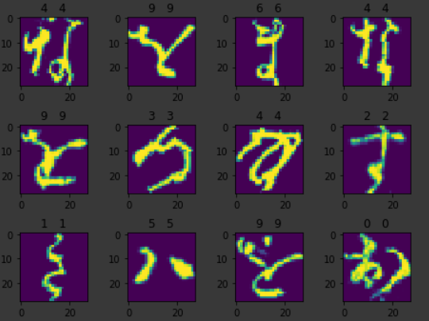

# Kuzushiji-MNIST Classifier Challenge

Hugo Coussens, Kevin Fung, Falola Yusuf, Nitchakul Pipitvej

  

The Kuzushiji-MNIST dataset (KMNIST) is a collection of ancient japanese characters. The problem arises out from the need to fast identify almost unrecognisable japanese texts. The project aim is to design an AlexNet based neural network model and pipeline to be able to accurately classify these japanese characters.

## Preparation/Usage
Pytorch and sklearn were dependencies for machine learning. 

Because our exploration was carried out via Google Colab, the majority of machine learning functionalities were encapsulated in the package [kmnist_helpers](https://github.com/kev-fung/KMNIST-Classifier/blob/master/kmnist_helpers/) to keep notebooks uncluttered. This can then be uploaded onto the google drive and imported into the virtual machine. 

## Exploration
Three notebooks and a kmnist ML package were developed.
1. `kmnist_helpers` Package includes all pytorch modelling functions, ensemble, and hyperparameter tuning.
2. `pipeline.ipynb` Main pipeline for producing final model predictions for kaggle submission.
3. `reclassification.ipynb` Exploratory notebook which investigates the misclassification of labels 2 and 6.
4. `distribution.ipynb` Exploratory notebook which investigates the uneven distrbution of training data.

## Data
The data should be downloaded from [here](https://www.kaggle.com/c/acse-module-8-19/data).

This should be placed in a folder within your google drive named "acse-module-8-19/" such that the following path is valid, and all the data is within this directory: 

`/content/gdrive/My Drive/Colab Notebooks/Mini-Project/acse-module-8-19/`

## Result
The final model obtained an accuracy of 97.914% on the private leaderboard, and 98.266% on the public leaderboard.

PyTorch models can be found in [models folder](https://github.com/kev-fung/KMNIST-Classifier/blob/master/models/).

## Extension
An extension into investigating the misclassification of predictions was carried out. It was found from the confusion matrix that labels 2 and 6 were getting confused. Upon looking into the actual characters corresponding to 2 and 6 it was clear how the neural network was misclassifying.

An idea to apply a 2D dimensionality reduction onto the predicted label features and reclassifying the two labels using a much simpler logistic regression model was explored. See [distribution.ipynb](https://github.com/kev-fung/KMNIST-Classifier/blob/master/distribution.ipynb)

## Relevant Links:
- Team Registration: https://www.kaggle.com/t/3713b8edcaab4ac7ac6045d7353c1aba
- Kaggle Competition Site + Leaderboard: https://www.kaggle.com/c/acse-module-8-19/overview
